# Цель работы
Цель данной лабораторной работы - освоение арифметческих инструкций
языка ассемблера NASM.


# Выполнение лабораторной работы

## Символьные и численные данные в NASM

Создаю каталог для программ лабораторной работы №6 и перехожу в него, создаю там файл (рис. -@fig:001).

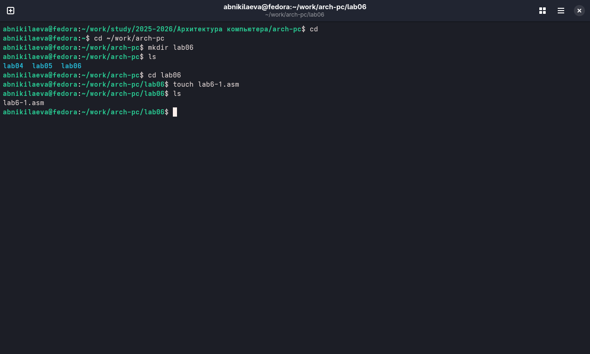{#fig:001 width=70%}

В созданном файле ввожу программу из листинга (рис. -@fig:002).

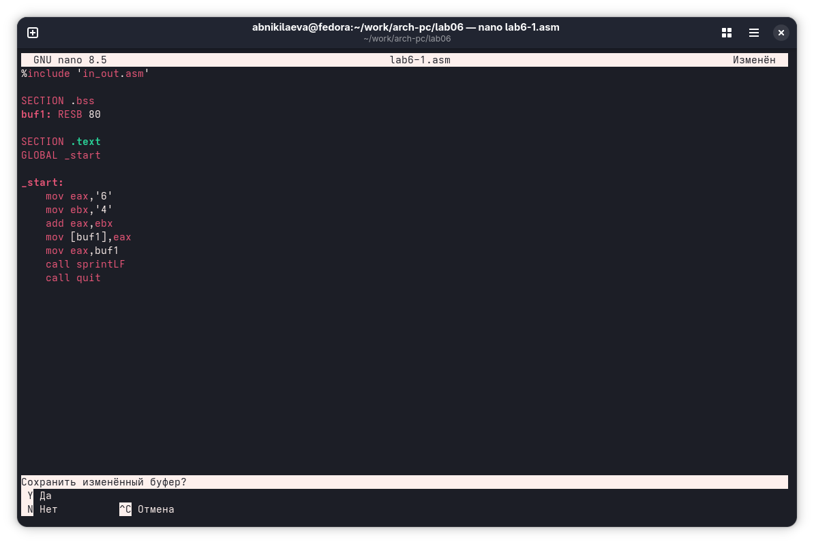{#fig:002 width=70%}

Создаю исполняемый файл и запускаю его, вывод программы отличается от предполагаемого изначально, ибо коды символов в сумме дают символ j по таблице ASCII. {#fig:003 width=70%} 

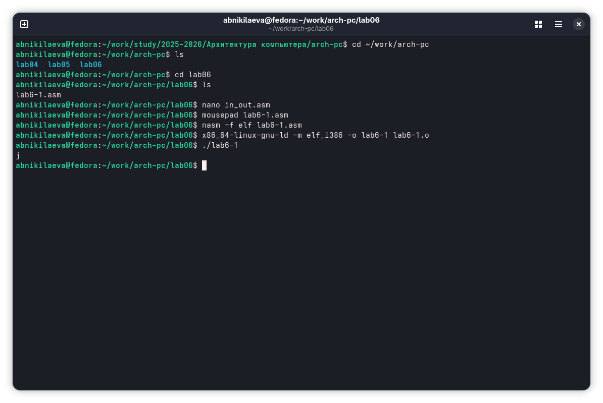{#fig:003 width=70%}

Изменяю текст изначальной программы, убрав кавычки (рис. -@fig:004).

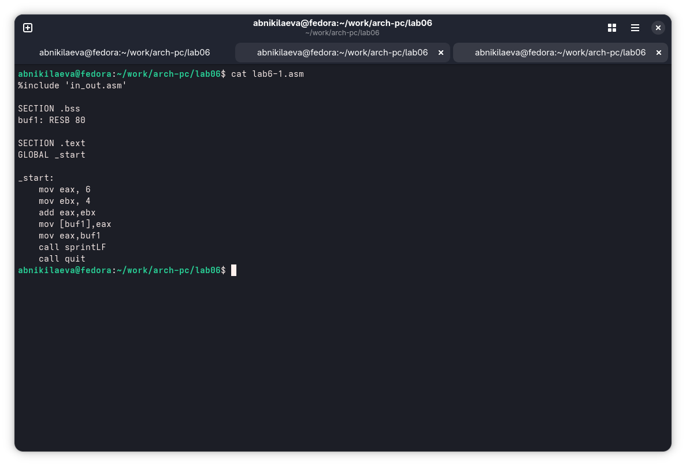{#fig:004 width=70%}

На этот раз программа выдала пустую строчку, это связано с тем, что символ 10 означает переход на новую строку (рис. -@fig:005).

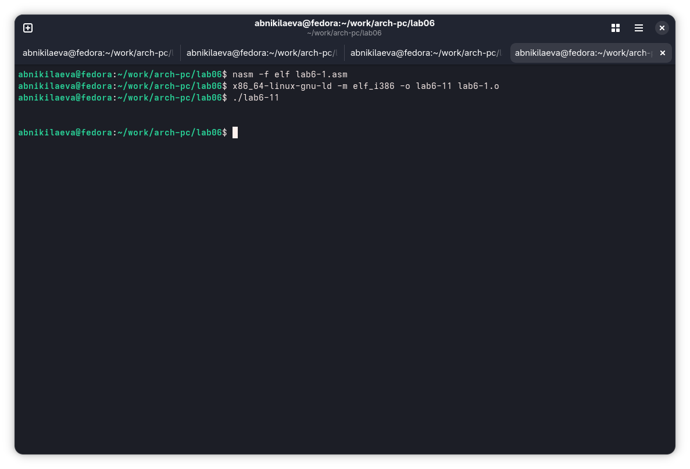{#fig:005 width=70%}

Создаю новый файл для будущей программы и записываю в нее код из листинга (рис. -@fig:006).

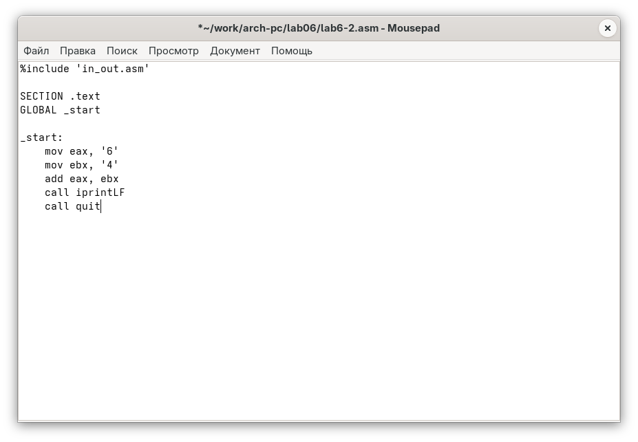{#fig:006 width=70%}

Создаю исполняемый файл и запускаю его, теперь отображается результат 106, программа, как и в первый раз, сложила коды символов, но вывела само число, а не его символ, благодяря замене функции вывода на iprintLF (рис. -@fig:007).

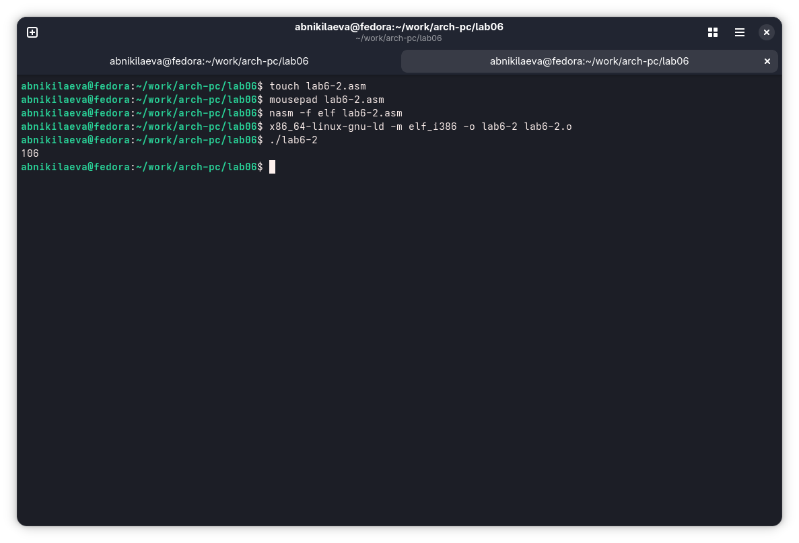{#fig:007 width=70%}

Убрав кавычки в программе, я снова ее запускаю и получаю предполагаемый изначально результат. (рис. -@fig:008).

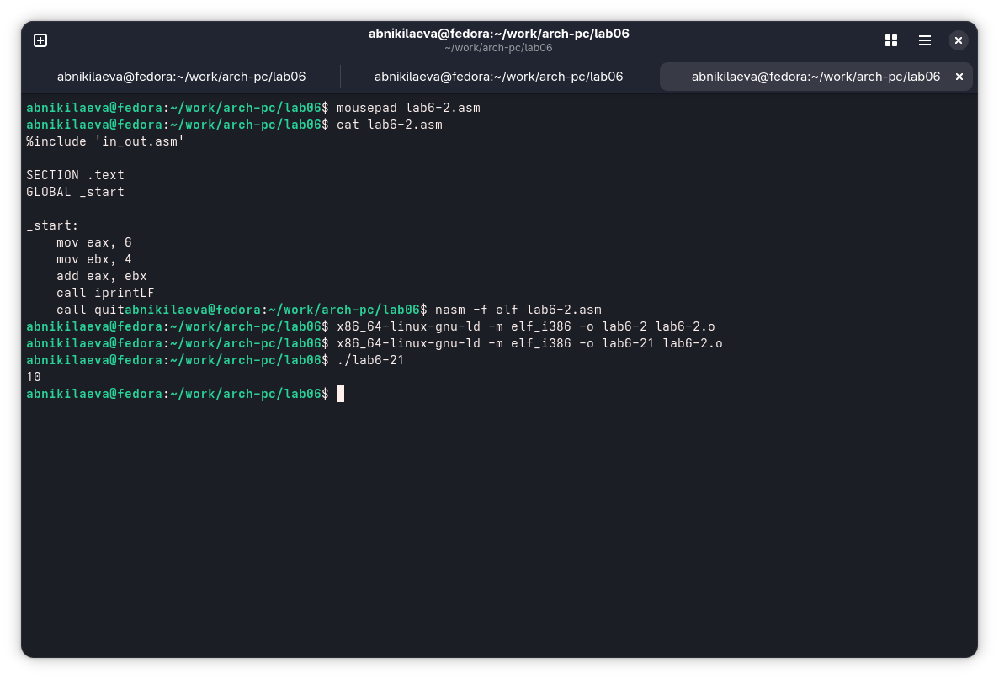{#fig:008 width=70%}

Заменив функцию вывода на iprint, я получаю тот же результат, но без переноса строки (рис. -@fig:009).

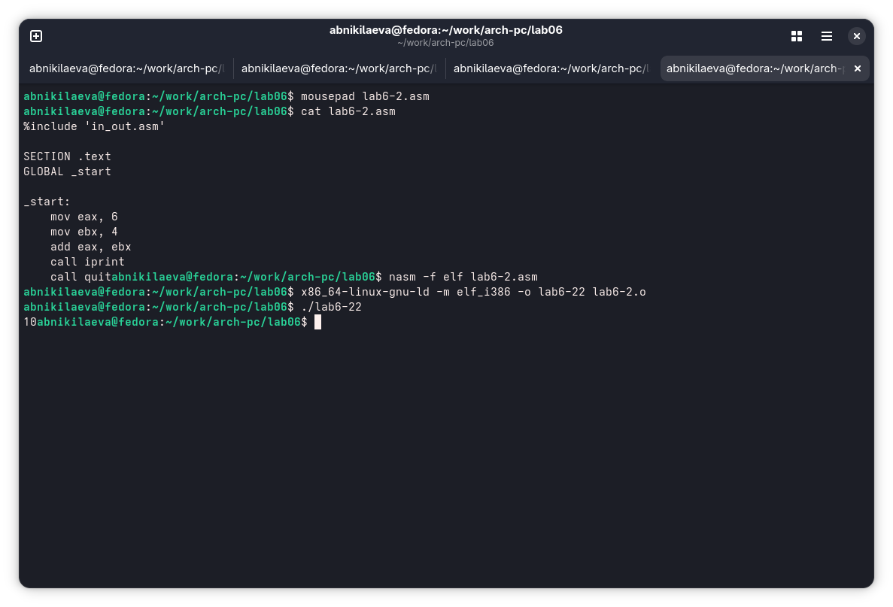{#fig:009 width=70%}

## Выполнение арифметических операций в NASM

Создаю новый файл и копирую в него содержимое листинга (рис. -@fig:010).

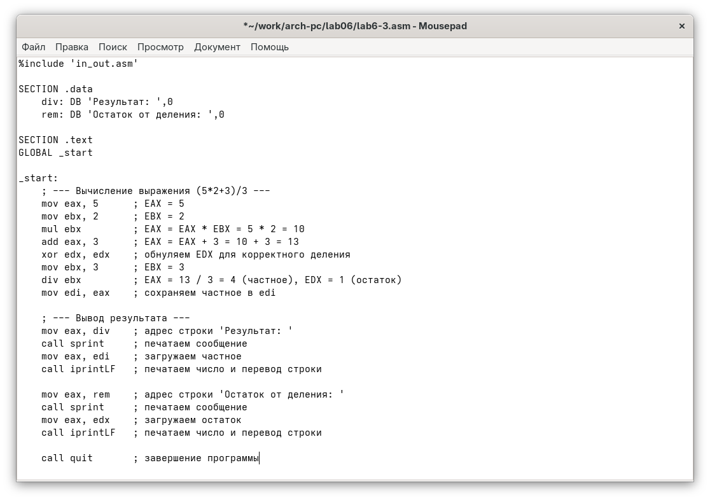{#fig:010 width=70%}

Программа выполняет арифметические вычисления, на вывод идет результирующее выражения и его остаток от деления (рис. -@fig:011).

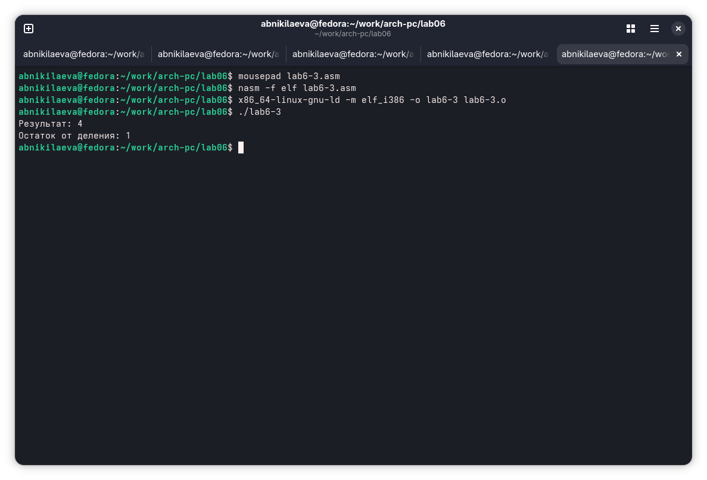{#fig:011 width=70%}

Заменив переменные в программе для выражения f(x) = (4*6+2)/5 (рис. -@fig:012).

{#fig:012 width=70%}

Запуск программы дает корректный результат (рис. -@fig:013).

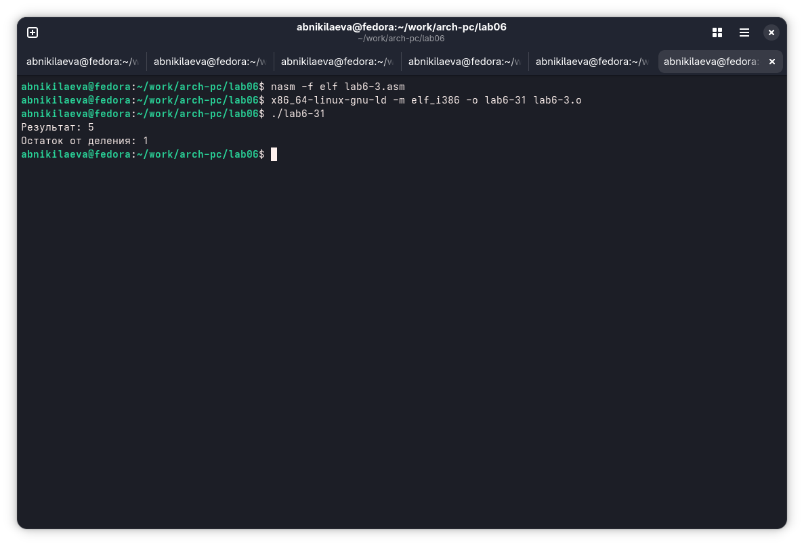{#fig:013 width=70%}

Создаю новый файл и помещаю текст из листинга (рис. -@fig:014).

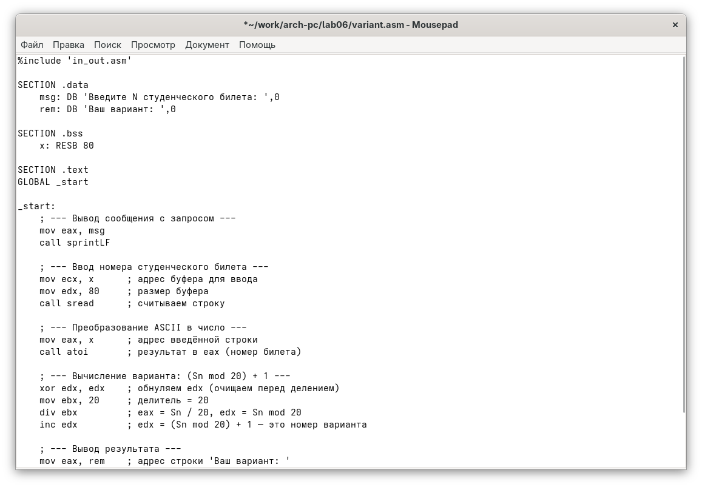{#fig:014 width=70%}

Запустив программу и указав свой номер студенческого билета, я получил свой вариант для дальнейшей работы. (рис. -@fig:015).

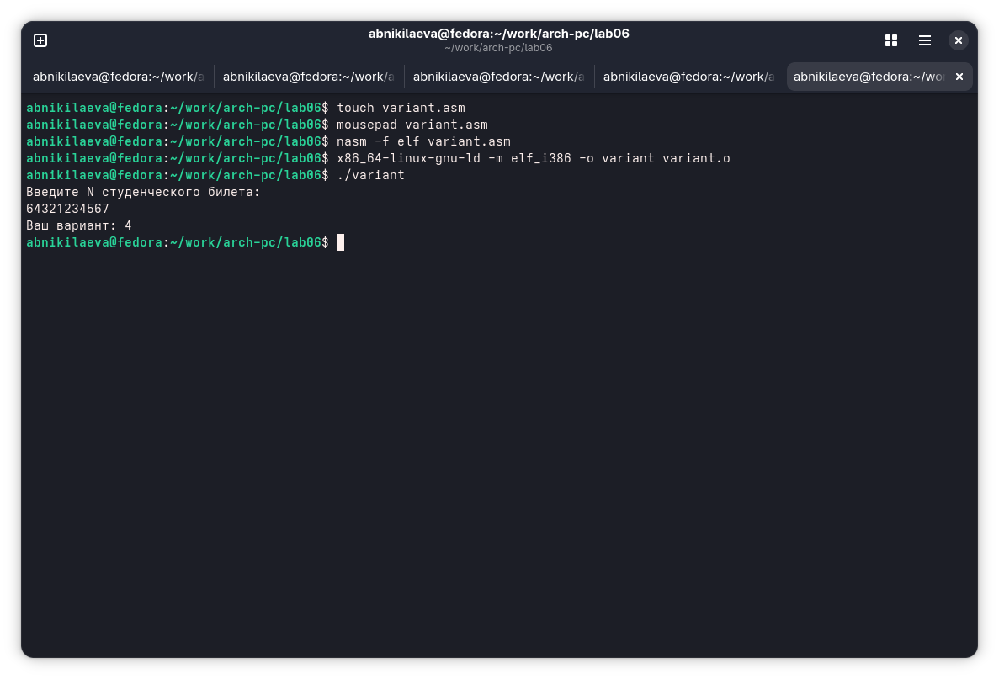{#fig:015 width=70%}

## Ответы на контрольные вопросы

1. За вывод сообщения “Ваш вариант” отвечают строки кода:

```NASM
mov eax,rem
call sprint
```
2. Инструкция mov ecx, x используется, чтобы положить адрес вводимой строки x в регистр ecx mov edx, 80 - запись в регистр edx длины вводимой строки
call sread - вызов подпрограммы из внешнего файла, обеспечивающей ввод
сообщения с клавиатуры.

3. call atoi используется для вызова подпрограммы из внешнего файла, которая преобразует ascii-код символа в целое число и записывает результат в
регистр eax.

4. За вычисления варианта отвечают строки:

```NASM
xor edx,edx ; обнуление edx для корректной работы div
mov ebx,20 ; ebx = 20
div ebx ; eax = eax/20, edx - остаток от деления
inc edx ; edx = edx + 1
```

5. При выполнении инструкции div ebx остаток от деления записывается в
регистр edx.

6. Инструкция inc edx увеличивает значение регистра edx на 1.

7. За вывод на экран результатов вычислений отвечают строки:

```NASM
mov eax,edx
call iprintLF
```

## Задание для самостоятельной работы

В соответсвии с выбранным вариантом, я реализую программу для подсчета функции f(x) = 10+(31x-5), проверка на нескольких переменных показывает корректное выполнение программы (рис. -@fig:016).

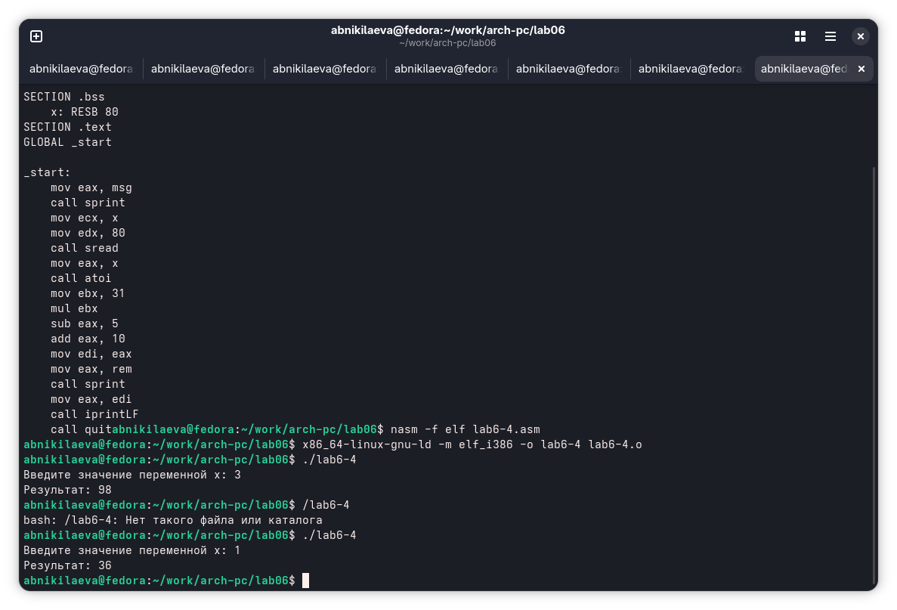{#fig:016 width=70%} 

Прилагаю код своей программы:

```NASM
%include 'in_out.asm'
SECTION .data
msg: DB 'Введите значение переменной х: ',0
rem: DB 'Результат: ',0
SECTION .bss
x: RESB 80
SECTION .text
GLOBAL _start
_start:
mov eax, msg
call sprint
mov ecx, x
mov edx, 80
call sread
mov eax, x
call atoi
mov ebx, 31
mul ebx
sub eax, 5
add eax, 10
mov edi, eax
mov eax, rem
call sprint
mov eax, edi
call iprint
```

# Выводы

При выполнении данной лабораторной работы я освоил арифметические инструкции языка ассемблера NASM.
